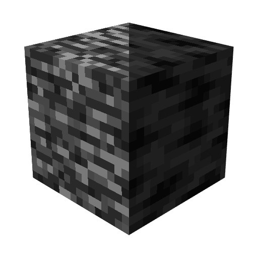

<div align="center">
  <h1>
    <br/>
    Jappa Bedrock 🕳️<br/>
    
    <br/>
    <a href="https://modrinth.com/resourcepack/jappa-bedrock">
      </img>
    </a>
  </h1>
</div>

**A Minecraft Java Edition resource pack** that reimagines the Bedrock texture from scratch. Instead of updating or modifying the original texture, this pack presents Bedrock exactly as Jappa would have designed it on a blank canvas, fully embracing the clean, modern aesthetic of contemporary Minecraft.

## 👁️‍🗨️ Overview


## 🛠️ Packaging

This repository uses [Nix](https://nixos.org) to automate the packaging process, which is required to package the resource pack.

> [!TIP]
> 📁 [`src/`](src/) – Contains the raw source files of the resource pack that will be packaged.
>
> 📦 [`packages/`](packages/) – The directory where the final, ready-to-use resource packs are generated and stored.

### 👣 Steps

1. **Enter the Nix environment:**
   Open your terminal in the root directory of the repository and run:
   ```bash
   nix-shell
   ```
   *This will automatically download and install all necessary tools.*

2. **Build the pack:**
   Inside the Nix shell, run the following command to package the resource pack:
   ```bash
   make
   ```

## 💝 Acknowledgements

* This repository is generated from the [mc-pack-env](https://github.com/segabass65/mc-pack-env) template.
